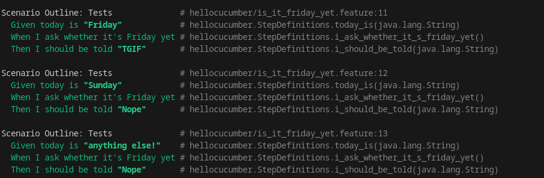

= R5.A.08 -- Dépôt pour les TPs
:icons: font
:MoSCoW: https://fr.wikipedia.org/wiki/M%C3%A9thode_MoSCoW[MoSCoW]

Ce dépôt concerne les rendus de mailto:nathan.pagnucco@etu.univ-tlse2.fr[Nathan Pagnucco].

== TP1

Contenu de is_it_friday_yet.feature

[source,gherkin]
----
Feature: Is it Friday yet?
    Everybody wants to know when it's Friday
    Scenario Outline: Tests
        Given today is "<day>"
        When I ask whether it's Friday yet
        Then I should be told "<answer>"
        Examples:
            | day | answer |
            | Friday  | TGIF  | 
            | Sunday  | Nope  |
            | anything else!  | Nope  |
----

== TP2

Contenu de order.java 

[source,gherkin]
----
package dojo;

import java.util.ArrayList;
import java.util.List;

class Order {
    String owner;
    String target;
    List<String> cocktails = new ArrayList<>();

    public void declareOwner(String owner) {
        this.owner = owner;
    }

    public void declareTarget(String target) {
        this.target = target;
    }

    public List<String> getCocktails() {
        return cocktails;
    }
}
----