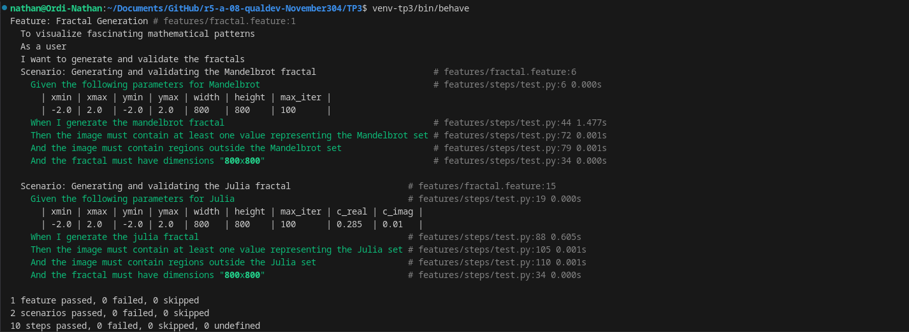

= R5.A.08 -- Dépôt pour les TPs
:icons: font
:MoSCoW: https://fr.wikipedia.org/wiki/M%C3%A9thode_MoSCoW[MoSCoW]

Ce dépôt concerne les rendus de mailto:nathan.pagnucco@etu.univ-tlse2.fr[Nathan Pagnucco].

Lien github : https://github.com/IUT-Blagnac/r5-a-08-qualdev-November304

== TP1

Contenu de is_it_friday_yet.feature

[source,gherkin]
----
Feature: Is it Friday yet?
    Everybody wants to know when it's Friday
    Scenario Outline: Tests
        Given today is "<day>"
        When I ask whether it's Friday yet
        Then I should be told "<answer>"
        Examples:
            | day | answer |
            | Friday  | TGIF  | 
            | Sunday  | Nope  |
            | anything else!  | Nope  |
----

image::Tests.png[width=80%]

== TP2

Contenu de order.java 

[source,gherkin]
----
package dojo;

import java.util.ArrayList;
import java.util.List;

class Order {
    String owner;
    String target;
    List<String> cocktails = new ArrayList<>();

    public void declareOwner(String owner) {
        this.owner = owner;
    }

    public void declareTarget(String target) {
        this.target = target;
    }

    public List<String> getCocktails() {
        return cocktails;
    }
}
----

Résultat des tests : 

== TP3

Contenu de fractal.feature

[source,gherkin]
----
Feature: Fractal Generation
  To visualize fascinating mathematical patterns
  As a user
  I want to generate and validate the fractals

  Scenario: Generating and validating the Mandelbrot fractal
    Given the following parameters for Mandelbrot:
      | xmin   | xmax   | ymin   | ymax   | width | height | max_iter |
      | -2.0   | 2.0    | -2.0   | 2.0    | 800   | 800    | 100      |
    When I generate the mandelbrot fractal
    Then the image must contain at least one value representing the Mandelbrot set
    And the image must contain regions outside the Mandelbrot set
    And the fractal must have dimensions "800x800"

  Scenario: Generating and validating the Julia fractal
    Given the following parameters for Julia:
      | xmin   | xmax   | ymin   | ymax   | width | height | max_iter | c_real | c_imag |
      | -2.0   | 2.0    | -2.0   | 2.0    | 800   | 800    | 100      | 0.285  | 0.01   |
    When I generate the julia fractal
    Then the image must contain at least one value representing the Julia set
    And the image must contain regions outside the Julia set
    And the fractal must have dimensions "800x800"
----

Contenu des tests pythons : 

[source,python]
----
from behave import given, when, then
import numpy as np

# Reutilisable

@given('the following parameters for Mandelbrot')
def step_given_parametersMb(context):
    for row in context.table:
        context.params = {
            "xmin": float(row['xmin']),
            "xmax": float(row['xmax']),
            "ymin": float(row['ymin']),
            "ymax": float(row['ymax']),
            "width": int(row['width']),
            "height": int(row['height']),
            "max_iter": int(row['max_iter'])
        }

@given('the following parameters for Julia')
def step_given_parametersMb(context):
    for row in context.table:
        context.params = {
            "xmin": float(row['xmin']),
            "xmax": float(row['xmax']),
            "ymin": float(row['ymin']),
            "ymax": float(row['ymax']),
            "width": int(row['width']),
            "height": int(row['height']),
            "max_iter": int(row['max_iter']),
            "c_real": float(row['c_real']),
            "c_imag": float(row['c_imag'])
        }

@then('the fractal must have dimensions "{width}x{height}"')
def step_then_check_dimensions(context, width, height):
    expected_width = int(width)
    expected_height = int(height)
    fractal_shape = context.fractal.shape
    assert fractal_shape == (expected_height, expected_width), \
        f"Expected dimensions: {expected_width}x{expected_height}, but got: {fractal_shape}"

# Pr la fractale de mandelbrot

@when('I generate the mandelbrot fractal')
def step_when_generate_fractal(context):
    def mandelbrot(c, max_iter):
        z = 0
        for n in range(max_iter):
            if abs(z) > 2:
                return n
            z = z**2 + c
        return max_iter

    def generate_fractal(xmin, xmax, ymin, ymax, width, height, max_iter):
        real = np.linspace(xmin, xmax, width)
        imag = np.linspace(ymin, ymax, height)
        fractal = np.zeros((height, width))

        for i, im in enumerate(imag):
            for j, re in enumerate(real):
                fractal[i, j] = mandelbrot(complex(re, im), max_iter)
        return fractal

    params = context.params
    context.fractal = generate_fractal(
        params["xmin"], params["xmax"],
        params["ymin"], params["ymax"],
        params["width"], params["height"],
        params["max_iter"]
    )

@then('the image must contain at least one value representing the Mandelbrot set')
def step_then_contains_mandelbrot(context):
    fractal = context.fractal
    max_iter = context.params["max_iter"]
    assert np.any(fractal == max_iter), \
        "No values in the image represent points in the Mandelbrot set."

@then('the image must contain regions outside the Mandelbrot set')
def step_then_contains_outside(context):
    fractal = context.fractal
    max_iter = context.params["max_iter"]
    assert np.any(fractal < max_iter), \
        "No regions outside the Mandelbrot set were found in the image."

# Pr la fractale de julia

@when(u'I generate the julia fractal')
def step_impl(context):
    x = np.linspace(context.params["xmin"], context.params["xmax"], context.params["width"])
    y = np.linspace(context.params["ymin"], context.params["ymax"], context.params["height"])
    X, Y = np.meshgrid(x, y)
    Z = X + 1j * Y 
    image = np.zeros(Z.shape, dtype=int) 

    c = complex(context.params["c_real"], context.params["c_imag"])

    for i in range(context.params["max_iter"]):
        Z = Z**2 + c 
        mask = np.abs(Z) > 2  
        image[mask] = i 

    context.fractal = image

@then(u'the image must contain at least one value representing the Julia set')
def step_impl(context):
    assert np.any(context.fractal > 0), "L'image ne contient pas de valeurs représentant l'ensemble de Julia"

@then(u'the image must contain regions outside the Julia set')
def step_impl(context):
    assert np.any(context.fractal == 0), "L'image ne contient pas de régions en dehors de l'ensemble de Julia"
----

Objectifs : 

J'avais un projet de fractales de NSI et j'ai voulu rajouté la méthode de BDD avec des tests sur les fractales de Mandelbrot et de Julia.
En retrospective il y a pas beaucoup de tests à faire sur les fractales donc ils sont assez génériques.

Image des tests :

== TP4

=== Résultat de doc minimal cucumber

Cucumber Demo : 

[source,shell]
----
include::cucumber_demo/report.txt[]
----

Hellocucumber :

[source,shell]
----
include::hellocucumber/report.txt[]
----

=== Documentation améliorée de cucumber

Impossible de faire marcher les commandes pour la documentation améliorée sur ma machine.

=== Cukedoctor

Sur le projet TP2 le cukedoctor est disponible au chemin suivant : 

[source,adoc]
----
include::hellocucumber/cukedoctor/documentation.adoc[]
----

Pour le projet python du TP3, le fichier json généré par behave n'est pas conforme au fichier .json attendu par cukedoctor, je n'ai donc pas pu généré la documentation avec cukedoctor.
Il y a un convertisseur mais il date de 7 ans et n'est pas installable avec pip.

